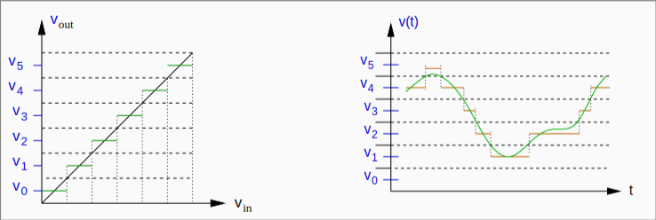

# Segnali

La maggior parte dei sistemi digitali utilizzano grandezze binarie per la codifica delle informazioni. Questo presenta vantaggi dal punto di vista dell'affidabilità, memorizzazione, elaborazione. Ciascun segnale può assumere valori all'interno di un intervallo finito o infinito.

I segnali analogici possono teoricamente rappresentare una quantità infinita di informazioni, ma in realtà sono limitati da:

- rumore -> disturbo con caratteristiche casuali e di diverse origini
- accuratezza degli strumenti di misura

## Discretizzazione

> Operazione che consente di passare da un segnale analogico ad uno discreto

