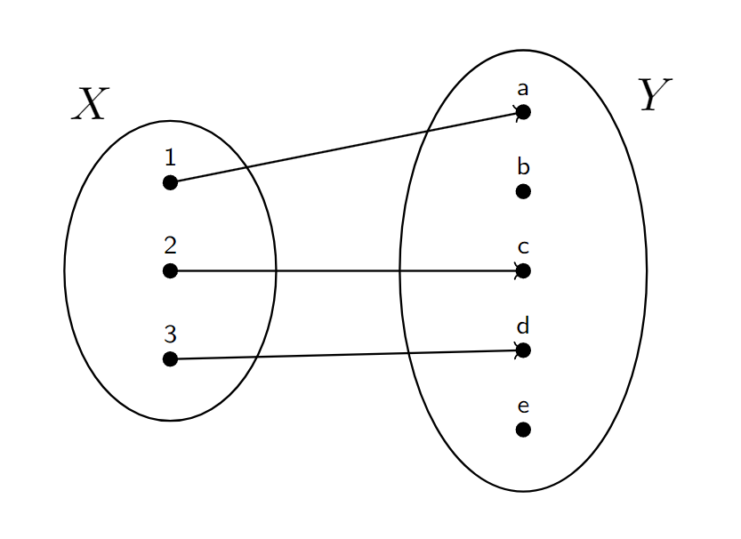
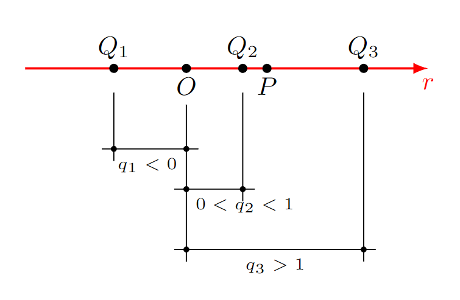

# 01 - Insiemi, Relazioni, Funzioni, Operazioni e Strutture Algebriche

## Partizione
> L'insieme dei sottoinsiemi di $X$ si dice **insieme delle parti di X** e si denota con $P(X)$, inclusi anche $X$ e $\emptyset$.

Una partizione $T$ di $X$ è un sottoinsieme dell'insieme delle parti $P(X)$ tale che:
- ogni elemento di $T$ è un sottoinsieme non vuoto di $X$
- gli elementi di T sono disgiunti a due a due: $A\cap B = \emptyset$ $\forall A, B \in T$
- l'unione degli elementi di $T$ è uguale ad $X$

Quindi, se $A = \{a, b, c\}$:
- $\{a, b\}, \{c\}$ è una partizione di $A$
- $\{a, b\}, \{b, c\}$ non è una partizione di $A$ (non vale la 2)
- $\{a\}, \{b\}$ non è una partizione di $A$ (non vale la 3)

## Relazioni
> Una relazione $R$ in $X$ è un sottoinsieme del prodotto cartesiano $X\times X$: $R \subseteq X\times X$.

In pratica, dati $x_1, x_2 \in X$, tra $x_1$ e $x_2$ intercorre una relazione $R$ se e solo se la coppia ordinata $(x_1, x_2)$ appartiene ad $R$.
$$x_1Rx_2 \Longleftrightarrow (x_1, x_2) \in R\subseteq X\times X$$

## Classe di equivalenza
Una classe di equivalenza è un sottoinsieme di $A$ formato da tutti gli elementi che sono considerati equivalenti secondo una relazione di equivalenza.

## Proprietà
### Riflessiva
Una relazione $R$ su un insieme $A$ è riflessiva se, per ogni elemento xx in $A$, vale:
$$xRx$$

### Simmetrica
Una relazione $R$ su un insieme $A$ è simmetrica se, per ogni coppia di elementi $x,y$ in $A$, vale:
$$xRy\Longrightarrow yRx$$
*Esempio*: La relazione "essere amici" è spesso simmetrica, perché se $x$ è amico di $y$, allora anche $y$ è amico di $x$.

### Transitiva
Una relazione $R$ su un insieme $A$ è transitiva se, per ogni terna di elementi $x,y,z$ in $A$, vale:
$$xRy \text{ e } yRz \Longrightarrow xRz$$
*Esempio*: La relazione "essere più alto di" è transitiva: se $x$ è più alto di $y$ e $y$ è più alto di $z$, allora $x$ è più alto di $z$.

## Insieme differenza
È l'insieme di elementi A che NON appartengono a B. Si indica con:
$$A - B \text{ o } A\backslash B$$

## Insieme quoziente
L’insieme delle classi di equivalenza di $X$ rispetto a $R$ viene chiamato insieme quoziente di $X$ rispetto a $R$ e viene indicato con $X/R$.

## Funzioni
Siano $X$ e $Y$ due insiemi.
Una funzione (o applicazione) $f$ da $X$ in $Y$ è una legge che associa ad ogni elemento $x\in X$ **uno e un solo elemento** $y\in Y$ e si scrive $f(x) = y \in Y$. Si scrive $f:X\to Y$ e $f:x\to y$.

*Terminologie*:
- $X$ si dice *dominio*: insieme di partenza
- $Y$ si dice *codominio*: insieme di arrivo
- $\Gamma$ grafico di $f$. $\Gamma = \{(1, a), (2, c), (3, d) \} \subseteq X\times Y$

### Immagine diretta e inversa
Sia $f: X \to Y$.
- Dato $x \in X$, $f(x) = y \in Y$ si dice immagine di $x$ in $Y$ tramite $f$.
- Dato $y \in Y$, allora il sottoinsieme di $X$ dato da $f^{-1}(y) = \{x\in X : f(y) = x\}$ si dice immagine inversa di $y$ in $X$ tramite $f$.

### Proprietà
- **Funzione iniettiva**: sia $f:X\to Y$ una funzione. $f$ si dice iniettiva se $\forall a_1, a_2 \in X$, $a_1 \not= a_2$, si ha che $f(a_1) \not= f(a_2)$, ossia se a elementi distinti di $X$ corrispondono elementi distinti di $Y$. *Equivalentemente*: $\forall a_1, a_2 \in X$ con $f(a_1) = f(a_2)$ allora $a_1 = a_2$.
- **Funzione suriettiva**: Sia $f: X\to Y$ una funzione. $f$ si dice suriettiva se per ogni $v\in Y$ esiste $a\in X$ tale che $f(a) = b$, $f^{-1}(b) \not= \emptyset$, $ \forall b\in Y$. *Equivalentemente*: $f$ è suriettiva se l'immagine di $X$ in $Y$ tramite $f$ vale $Y$, ossia $f(X) = Y$.
- **Funzione biettiva (o biunivoca)**: Sia $f: X\to Y$ una funzione. $f$ si dice biettiva se è iniettiva e suriettiva. Si parla anche di corrispondenza biunivoca tra $X$ e $Y$.

### Funzione inversa
Quando $f: X\to Y$ è una funzione biettiva, allora ogni elemento di $Y$ deriva da un elemento e uno solo di $X$.
Si può allora definire una funzione da $Y$ ad $X$ associando ad ogni elemento $b \in Y$ l’unico elemento $a \in X$ tale che $f(a) = b$.
Tale funzione è detta inversa di $f$ e viene indicata con $f^{-1}$.
$$f^{-1}: Y \to X$$
Anche $f^{-1}$ è biettiva.
Sia $X$ che $Y$ hanno la stessa cardinalità (numero di elementi).

## Composizione di funzioni
Siano $g:A\to B$ e $f:B\to C$. La funzione $f\circ g:A\to C$ definita come $(f\circ g)(x) = f(g(x))$ è detta funzione composta di $f$ ed $g$.
Deve valere che $g(A) \subseteq B$, con $B$ dominio di $f$.

## Restrizione
Sia $f:A\to B$, e sia $A_1 \subseteq A$.
Sia può considerare la funzione $f_{A_1}:A_1\to B$ definita da $f_{A_1}(x) = f(x)$, per ogni $x\in A_1$. Tale funzione è detta restrizione di $f$ ad $A_1$.

## Operazioni e strutture algebriche
Sia $A$ un insieme non vuoto. Si dice operazione binaria o **logge di composizione interna** in $A$ una funzione:
$$\circ : A \times A \to A \\ (x, y) \to z$$
Se $x, y \in A$, l'operazione binaria tra $x$ e $y$ si denota $z=x\circ y \in A$.
*Esempio*: L’addizione e la moltiplicazione usuali in $\mathbb{N}$,$\mathbb{Z}$,$\mathbb{Q}$,$\mathbb{R}$,$\mathbb{C}$ sono operazioni binarie, che si denotano con $+$ e $·$.

Sia $A$ e $B$ insiemi non vuoti. Si dice **legge di composizione esterna** in $A$ con elementi in $B$ una funzione:
$$\star : B \times A \to A\\ (b, x)\to z$$
Se $b\in B$ e $x\in A$, si scrive $z=b\star x\in A$.

## Sistema di riferimento sulla retta
Data una retta $r$, un sistema di riferimento sulla retta (o sistema di coordinate) è individuato da una coppia ordinata di punti distinti $(O,P)$, detti rispettivamente punto origine e punto unità.

Il verso è quello secondo cui $P$ segue $O$. Pertanto viene individuata una relazione d'ordine sulla retta, secondo cui $P>O$. Quindi $r$ è una retta orientata da $O$ verso $P$.
La lunghezza di $OP$ è presa come unità di misura.

Disponendo i punti $O$ e $P$ oltre a definire vado a definire anche l'unità di misura. Viene quindi associato ad ogni punto $Q$ il numero reale $x$ tale che:
$$
x=
\left\{
\begin{array}{l}
0 \quad &Q = O \\
+ \text{misura di } OQ \text{ rispetto a } OP &Q > O \\
- \text{misura di } OQ \text{ rispetto a } OP &Q < O
\end{array}
\right.
$$
$x$ è detta *ascissa*.
**Importante!**: L'ascissa di $O$ è 0, l'ascissa di $P$ è 1.

*Terminologie*:
- Se le rette $OP_x$ e $OP_y$ sono ortogonali, allora il sistema di dice **ortogonale**.
- Se la lunghezza di $OP_x$ è uguale alla lunghezza di $OP_y$ allora il sistema di riferimento si dice **ortonormale**