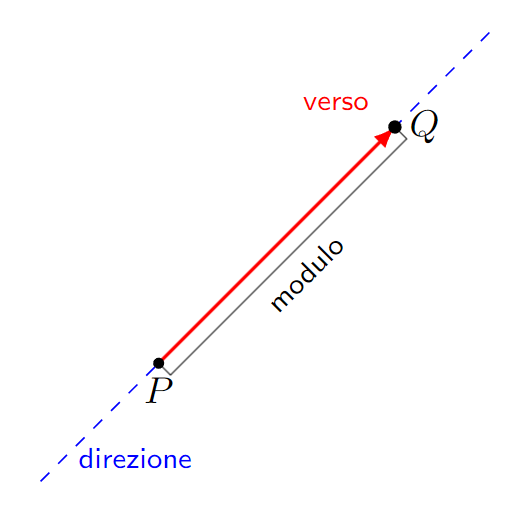

# 02 - Vettori Geometrici e Vettori Liberi, Operazioni con i Vettori, Prodotto Scalare, Vettoriale e Misto

## I vettori
> Dati due punti $P$ e $Q$ del piano, per vettore geometrico applicato in $P$ e di estremo $Q$ si intende il segmento orientato $\vec{PQ}$. Si può definire anche come coppia ordinata di punti $(P,Q)$ e denotare con $Q-P$.

I vettori applicati sono caratterizzati da:
- **direzione**: della retta a cui appartengono
- **verso**: quello che si osserva percorrendo il segmento orientato da $P$ a $Q$.
- **modulo**: $|PQ|$ (numero reale non negativo che esprime la lunghezza del segmento).

#### Osservazioni
- Se $P$ coincide con $Q$, allora $(P, Q)$ è detto **vettore applicato nullo** e viene indicato con $0$.
- Il vettore geometrico **opposto** al vettore $\vec{PQ}$ (indicato con $-\vec{PQ}$) è il vettore $\vec{PQ'}$, ove $Q'$ è simmetrico a $Q$ rispetto a $P$.
- Un vettore applicato è detto **versore** di una retta se giace su quella retta ed è di modulo unitario.

### Vettori equipollenti

Due vettori applicati $\vec{PQ}$ e $\vec{RS}$ sono equipollenti se e sole se sono paralleli (appartengono a rette parallele), concordi (hanno lo stesso verso) e hanno uguale modulo.

## Prodotto di un vettore per uno scalare

Sia $v$ un vettore e $k$ uno scalare (un numero reale). Il prodotto $k\cdot v$ è un nuovo vettore.
La lunghezza del nuovo vettore è uguale alla lunghezza del vettore originale moltiplicata per il valore assoluto di k.
- Se k è positivo, il nuovo vettore ha la stessa direzione del vettore originale.
- Se k è negativo, il nuovo vettore ha la direzione opposta rispetto a quella originale.

Fissato un sistema di coordinate cartesiane ortogonali nel piano di origine $O$, è facile vedere che un vettore applicato $\vec{OP}$, ove $(x,y)$ sono le coordinate di $P$, si può scrivere come $x\vec{i} + y\vec{j}$.

$$
\cos(\varphi) = \frac{x}{|OP|} \qquad
\sin(\varphi) = \frac{y}{|OP|} \qquad
\tan(\varphi) = \frac{y}{x}
$$

## Prodotto scalare
Siano $v_1 = [\overrightarrow{OP_1}]$ e $v_2 = [\overrightarrow{OP_2}]$ due vettori liberi e sia $\varphi$ l'angolo compreso tra i due vettori applicati $[\overrightarrow{OP_1}]$ e $[\overrightarrow{OP_2}]$. Si dice prodotto scalare tra i due vettori il numero reale dato da:
$$\langle \mathbf{v}_1, \mathbf{v}_2 \rangle \equiv |\overrightarrow{OP_1}| |\overrightarrow{OP_2}| \cos \varphi = x_1y_1 + x_2y_2$$
Il prodotto scalare è nullo se e solo se uno dei due vettori è nullo o se sono ortogonali.

# Formulario
- coseni direttori:
$cos(0) = \frac{\vec{i}}{|modulo|}$

- angolo compreso tra due vettori $v_1$ e $v_2$:
$$cos(\varphi) = \frac{<v1, v2>}{|v_1||v_2|}$$

- proiezione ortogonale $v_1'$ di $v_1$ su $v_2$:
$$v_1' = <v1, v2>\frac{w}{|v|^2}$$

- proiezione ortogonale di $w$ su sul piano di $v_1$ e $v_2$:
$$v_1' = \frac{<v_1, v_2\times v_3>}{|v_2\times v_3|}\frac{v_2\times v_3}{|v_2\times v_3|}$$