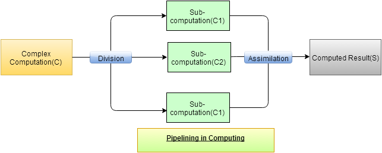
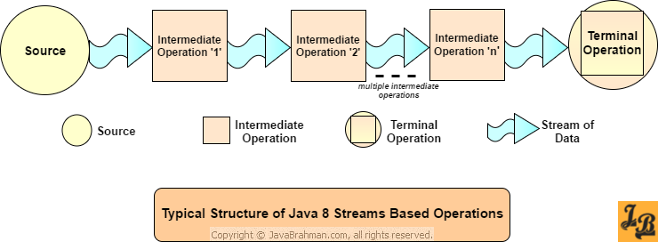
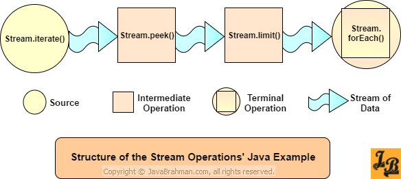
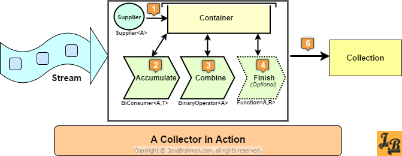

# stream API
È una sequenza di elementi che supporta operazioni parallele.

- Sequenza di elementi -> fornisce un'interfaccia ad un insieme sequenziato di valori di un tipo specifico.
- Origine degli elementi del flusso -> la fonte può essere una map, array, set, ...
- Operazioni sugli elementi del flusso -> è possibile dichiarare diverse operazioni predefinite che agiscono sugli elementi del flusso.
- Operazione parallele e aggregate -> le operazioni che operano su questo flusso di elementi possono essere eseguite in parallelo.

## Pipelining
È la segmentazione di un processo computazionale in diversi sottoprocessi eseguiti da unità autonome dedicate. Le pipeline vengono usate dalle stream API per ottenere un'esecuzione efficiente in ciascuna serie di istruzioni.



Il "calcolo complesso" C viene scomposto nei sottocalcoli (C1, C2 e C3). Questi calcoli vengono elaborati in parallelo e assimilati alla fine per ottenere il risultato finale.

## Struttura delle Stream API



Qualsiasi operazione implichi l'utilizzo delle stream api deve avere 3 componenti fondamentali:
1. sorgente
2. operazioni intermedie -> funzionano come una catena di montaggio, il dato viene lavorato da ogni operazione intermedia.
3. operazione terminale -> è responsabile delle generazione dell'output finale e del tipo. (`findAny()`, `allMatch()`, `forEach()`, ...).
> [!NOTE]
> Lo stream non inizia l'elaborazione se non rileva un'operazione finale

### Esempio esecuzione
```java
import java.util.stream.Stream;
public class InfiniteStreams {
  public static void main(String args[]) {
    Stream.iterate(0, n->n+2)
          .peek(num -> System.out.println("Peeked at:"+num))
          .limit(5)
          .forEach(System.out::println);
  }
}
```



Come si vede all'interno del programma le operazioni vengono eseguite dopo l'esecuzione del `forEach()` questo ad esempio permette alla funzione `iterate()` di non generare una "lista infinita" di numeri ma limitarsi alla quantità definita in `limit()`.

## Tipi di operazioni intermedie
Le operazioni intermedie possono essere divise in due categorie a seconda che memorizzino o meno il loro stato:
1. Operazioni intermedie con stato -> mantengono informazioni interne durante l'esecuzione (es. `distinct()` che deve ricordarsi gli elementi già incontrati)
2. Operazioni intermedie stateless -> non memorizzano alcun dato (es. `filter()`)

## Mapping
Si riferisce alla conversione o trasformazione di uno stream che trasporta un tipo di dati in un altro tipo. Tale conversione è possibile con i metodi `map()` e `flatMap()`. Quest'ultimo aiuta ad appiattire uno stream multilivello in un unico stream.

### `map()`
```java
static List<Employee> employeeList = Arrays.asList(new Employee("Tom Jones", 45));
 List<String> mappedList = employeeList.stream()
									   .map(emp -> emp.getName())
									   .collect(toList());
// OUTPUT: Tom Jones
```
In questo caso `map()` converte il flusso di dipendenti in un flusso di stringhe con solo i nomi dei dipendenti.

### `flatMap()`
Offre la possibilità di appiattire un flusso multilivello, creando quindi un singolo flusso di flussi.
```java
 public static void main(String args[]) {
  List<String> nameCharList = employeeList.stream()
							   .map(emp-> emp.getName().split(""))
							   .flatMap(array->Arrays.stream(array))
							   .map(str -> str.toUpperCase()) 
							   .filter(str -> !(str.equals(" ")))
							   .collect(toList());
   nameCharList.forEach(str -> System.out.print(str));
  }
}
```

## Filtraggio e Slicing
Gli stream supportano il filtraggio degli elementi e la separazione di porzioni di un elenco. Queste operazioni sono svolte dai metodi: 

### `filter(e -> e.getAge() >= 18)`
Applica all'intero flusso una condizione e restituisce un flusso con gli elementi che corrispondono alla soluzione. 

### `distinct()`
Restituisce uno stream che ha tutti gli elementi univoci.

### `limit(n)`
Restituisce un flusso che contiene esattamente `n` elementi.

### `skip(n)`
Restituisce una versione troncata del flusso originale, in modo che i primi `n` elementi vengano saltati.

## Matching
Vengono utilizzati per abbinare gli elementi in uno stream. Una volta definita la condizione elabora internamente la funzione di matching e fornisce il risultato.

### `allMatch(e -> e.getAge() > 18)`
Restituisce un risultato true se **tutti** gli elementi del flusso corrispondono alla condizione fornita.

### `anyMatch(e -> e.getAge() > 18)`
Restituisce un risultato true se **almeno 1** elemento del flusso corrisponde alla condizione fornita.

### `noneMatch(e -> e.getAge() > 18)`
Restituisce un risultato true se **nessun** elemento del flusso corrisponde alla condizione fornita.

## Collector
I metodi Collector raccolgono gli elementi elaborati dal flusso in un contenitore per una rappresentazione finale.



Ecco le operazioni principali:

| Operazioni                 | Metodi                | Scopo                                                                             |
| -------------------------- | --------------------- | --------------------------------------------------------------------------------- |
| media                      | `averagingInt()`          |                                                                                   |
| conteggio                  | `counting()`          |                                                                                   |
| raggruppamento             | `groupingBy()`        |                                                                                   |
| mappatura                  | `mapping()`           | Applica un'operazione a tutti gli elementi del flusso                             |
| massimo e minimo           | `maxBy()`/`minBy()`   | Trova il massimo/minimo del flusso in base al comparatore passato come argomento. |
| partizionamento            | `partitioningBy()`    |                                                                                   |
| riduzione                  | `reducing()`          |                                                                                   |
| somma                      | `summingDouble()`     |                                                                                   |
| raccolta in una collezione | `toCollection()`      |                                                                                   |
| raccolta in una mappa      | `toMap()`             |                                                                                   |
| raccolta in un elenco      | `toSet()`             |                                                                                   |
| raccogliere e trasformare  | `collectingAndThen()` |                                                                                   |

